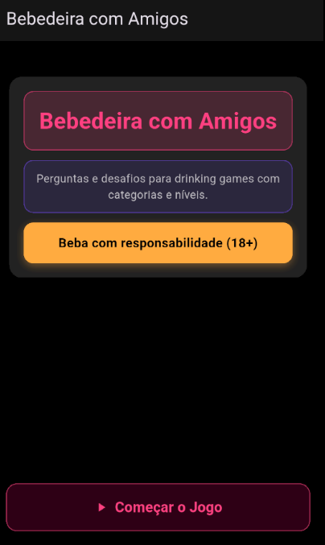
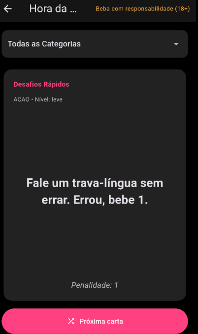

# Bebedeira com Amigos

Um jogo de beber para animar suas festas, desenvolvido em Flutter.

## Sobre o Projeto

**Bebedeira com Amigos** é um aplicativo de _drinking game_ totalmente offline, projetado para ser simples e divertido. O jogo funciona com base em um arquivo JSON local que contém uma variedade de perguntas e desafios, garantindo que a diversão nunca precise de conexão com a internet.

O objetivo é proporcionar uma experiência dinâmica para grupos de amigos, com cartas que trazem desde perguntas "Eu Nunca" até desafios rápidos e regras que mudam o jogo.

## Como Funciona

O aplicativo apresenta uma interface limpa e direta. Na tela inicial, os jogadores são recebidos com o nome do jogo e um botão para começar a partida.

Ao entrar na tela de jogo, uma carta aleatória é exibida no centro, contendo:
- **Categoria:** Como "Eu Nunca", "Verdade ou Desafio" ou "Picante".
- **Nível de Dificuldade:** Leve, médio ou pesado.
- **Texto Principal:** A pergunta ou o desafio a ser cumprido.
- **Goles:** A quantidade de goles associada à carta.

Os jogadores podem sortear uma nova carta a qualquer momento usando o botão "Próxima Carta". O aplicativo também inclui um filtro simples que permite ao grupo escolher jogar apenas com categorias específicas, personalizando a experiência da rodada. O design utiliza cores vibrantes (rosa, roxo e laranja) para criar um clima de festa e descontração.

## Imagens

